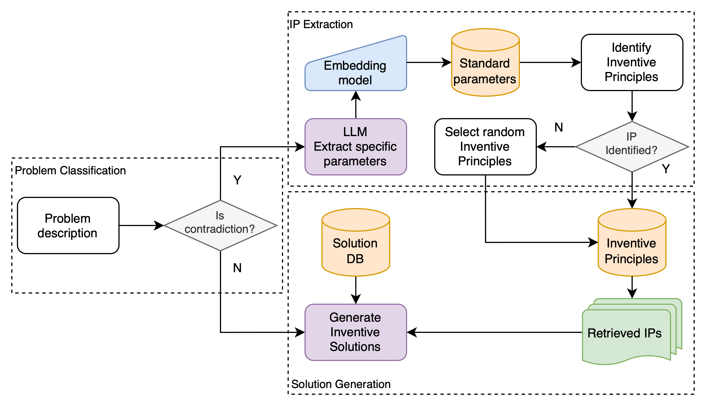

# TRIZ Contradiction Analysis System



*Technical Contradiction processing framework - the core workflow for analyzing problems and generating inventive solutions.*

A comprehensive TRIZ (Theory of Inventive Problem Solving) system consisting of:
- **Backend API**: FastAPI service for TRIZ analysis with semantic search and LLM-powered contradiction extraction
- **MCP Server**: Model Context Protocol server that brings TRIZ tools to Claude Desktop and LM Studio

## Quick Start

### Prerequisites

- Docker and Docker Compose

### 1. Clone and Configure

```bash
git clone https://github.com/mmysior/contradictions-api.git
cd contradictions-api
cp .env.example .env
```

Edit `.env` with your API keys:
```bash
OPENAI_API_KEY=your_openai_api_key_here
```

### 2. Start Everything

```bash
docker compose up -d
```

The API will be available at `http://localhost:8000/api/v1/` with interactive documentation at `http://localhost:8000/docs`.

The MCP server will be available at `http://localhost:8001/mcp`.

### 3. Connect MCP Server to Your AI Assistant

**For Claude Desktop:**

Add to your Claude Desktop config file:
```json
{
  "mcpServers": {
    "traicon": {
      "command": "npx",
      "args": [
        "mcp-remote",
        "http://localhost:8001/mcp"
      ]
    }
  }
}
```

**For LM Studio:**

Add to your `mcp.json` (Program tab → Install → Edit mcp.json):
```json
{
  "mcpServers": {
    "traicon": {
      "url": "http://127.0.0.1:8001/mcp"
    }
  }
}
```

## Components

### Backend API
A FastAPI service providing:
- Semantic search across 39 TRIZ parameters and 40 inventive principles
- TRIZ contradiction matrix lookups
- LLM-powered technical contradiction extraction
- Patent analysis and classification

See [backend/README.md](backend/README.md) for detailed API documentation.

### MCP Server
Brings TRIZ analysis tools to AI assistants, providing:
- Technical contradiction formulation
- Parameter and principle search
- Matrix-based principle recommendations
- Random principle generation for inspiration

See [mcp-server/README.md](mcp-server/README.md) for MCP-specific documentation.

## Architecture

The system follows a modular architecture:
1. **Backend API** handles all TRIZ logic, LLM calls, and semantic search
2. **MCP Server** exposes TRIZ tools to AI assistants via the Model Context Protocol
3. **Docker Compose** runs both services together for easy deployment

## Data Customization

Customize TRIZ parameters, principles, and matrix by editing files in the `./data/` directory.

## License

MIT License - see [LICENSE](LICENSE) file for details.

## Citation

If you use TRIZ Contradiction API in your projects, please consider citing:

```bibtex
@software{TRIZ_Contradiction_API,
  author = {Mysior, M.},
  title = {TRIZ Contradiction API},
  url = {https://github.com/mmysior/contradictions-api},
  doi = {10.5281/zenodo.17042046},
  version = {0.1.0},
  year = {2025}
}
```

## Funding

This system was developed as part of research supported by the National Science Centre, Poland (grant no. 2024/08/X/ST8/00391).
